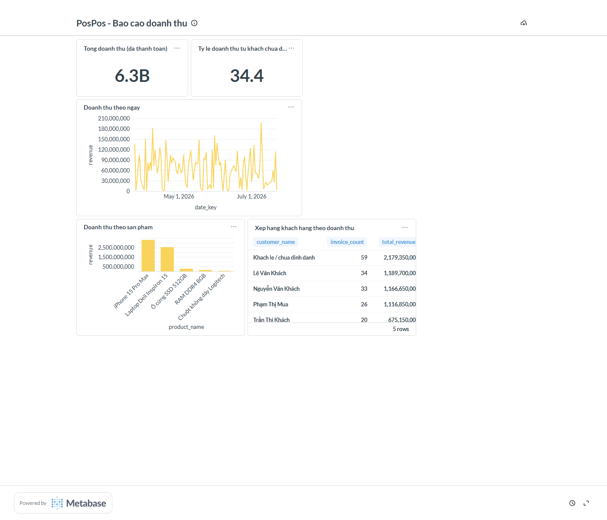

# PosPos — Metabase (Visualization)

Lop Visualization cho pipeline ELT cua PosPos. Dashboard **"PosPos - Bao cao doanh
thu"** doc truc tiep tu cac bang `analytics.mart_*` do dbt tao ra (xem `../dbt/`) —
khong query thang vao bang OLTP.



5 card:
- **Tong doanh thu (da thanh toan)** — scalar
- **Ty le doanh thu tu khach chua dinh danh (%)** — scalar, lay tu
  `mart_customer_ranking` (xem ghi chu ve `dim_customer` trong `../dbt/README.md`)
- **Doanh thu theo ngay** — line chart tu `mart_revenue_daily`
- **Doanh thu theo san pham** — bar chart tu `mart_revenue_by_product`
- **Xep hang khach hang theo doanh thu** — table tu `mart_customer_ranking`

## Setup

```bash
cd Backend
docker compose -f docker-compose.yml -f docker-compose.metabase.yml up -d
```

Mo `http://localhost:3000`, lan dau se yeu cau tao tai khoan owner (email + password
tuy chon). Sau do, dung script sau de tu dong dung ket noi database + 5 card + layout
dashboard (khong can click tay trong UI):

```bash
pip install requests
cd metabase
METABASE_URL=http://localhost:3000 \
METABASE_USER=<email vua tao> \
METABASE_PASSWORD=<password vua tao> \
python setup_dashboard.py
```

Script idempotent — chay lai nhieu lan chi cap nhat card/dashboard da co, khong tao
trung lap (da kiem tra thuc te: chay lan 2 van chi ra 5 dashcard, khong nhan doi).

## Da xac nhan hoat dong that

Dashboard trong anh chup o tren duoc dung bang chinh script nay, tren du lieu that
cua project (180 hoa don, ~4 thang) — khong phai mockup. Tat ca 5 card da chay qua
API (`POST /api/card/:id/query`) va tra ve du lieu thanh cong truoc khi chup anh.
